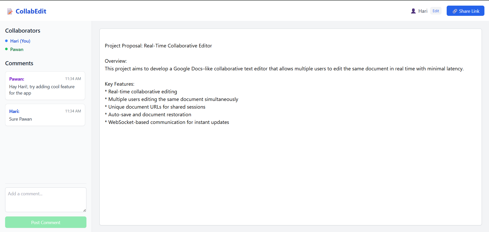
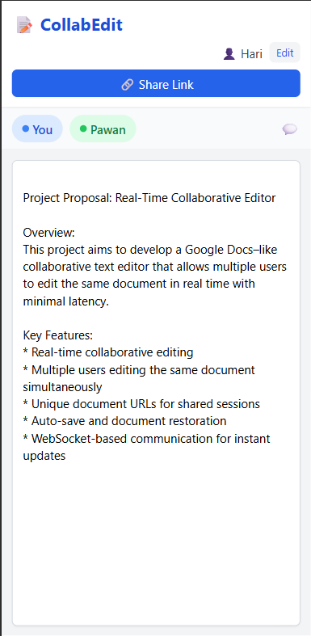

# ✍️ Collaborative Editor UI

Welcome to **Collaborative Editor** - a real-time collaborative document editor that brings Google Docs-like experience to life using **Angular**, **WebSockets**, and a robust **Spring Boot** backend.

> 🔧 This is the **Frontend (UI)** of the project. You can find the backend here: [CollabEditor Backend](https://github.com/thughari/CollabEditor)

---

## 🌍 Live App

> 🚀 https://thughari.github.io/Collaborative-Editor-UI

---

## 🛠️ Tech Stack

**Frontend:**

* ⚙️ Angular
* 📡 WebSocket integration
* 💅 CSS + Tailwind

**Backend:**

* ☕ Java 17
* 🧩 Spring Boot
* 🔄 WebSocket (Spring's ```TextWebSocketHandler```)
* 💾 MongoDB (for persistence)
* 🌐 Deployed via Render

---

## 💡 Features

* 📝 Real-time collaborative editing
* 👥 Multiple users editing the same document simultaneously
* 🔗 Unique document URLs for shared sessions
* 🔒 Auto-save and document restoration
* ⚙️ WebSocket-based communication for instant updates

---

## 🧑‍💻 Local Setup

### 1. Clone the Repositories

```bash
# Frontend
git clone https://github.com/thughari/Collaborative-Editor-UI.git

# Backend
git clone https://github.com/thughari/CollabEditor.git
```

### 2. Run Backend (Spring Boot)

```bash
cd CollabEditor
./mvnw spring-boot:run
```

The backend runs on `http://localhost:8080`.

> ⚠️ Ensure MongoDB is running locally or configure it in `application.properties`.

### 3. Run Frontend (Angular)

```bash
cd Collaborative-Editor-UI
npm install
ng serve
```

Frontend runs on `http://localhost:4200`.

---

## 🧪 How It Works

1. Open `http://localhost:4200`.
2. You’re assigned a unique document ID.
3. Share the URL with others.
4. Everyone edits the same document in real time.
5. Backend syncs and persists content using WebSockets and MongoDB.

---

## 📸 Screenshots

| Chat Window | Responsive Design |
|-------------|------------------|
|  |  |

---

## 🧑‍🤝‍🧑 Contributing

We welcome contributions! Here's how to get started:

```bash
git checkout -b feature/your-feature
git commit -m "Add new feature"
git push origin feature/your-feature
```

Then open a Pull Request ✅

---

## 👨‍💻 Developed by

**Hari Thatikonda**
📫 [LinkedIn](https://linkedin.com/in/hari-thatikonda) | [GitHub](https://github.com/thughari)

---

## 📝 License

MIT — use it freely, improve it collaboratively.
